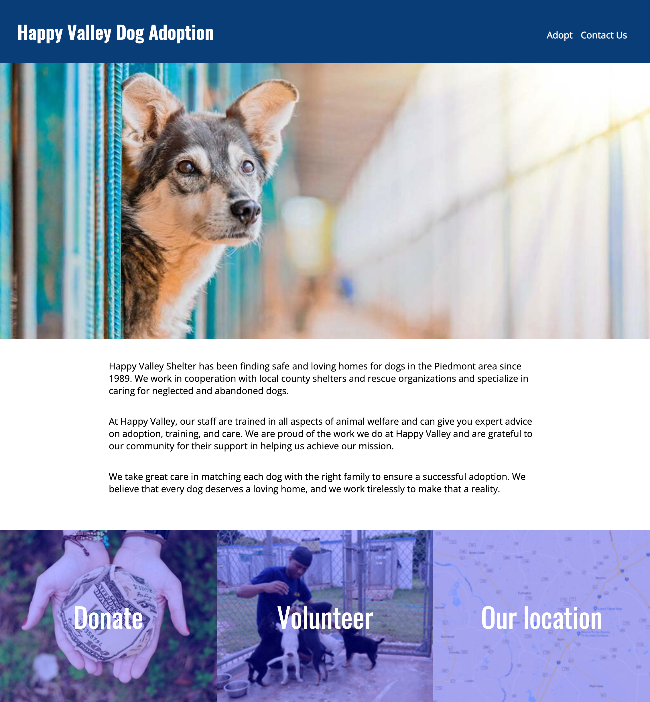
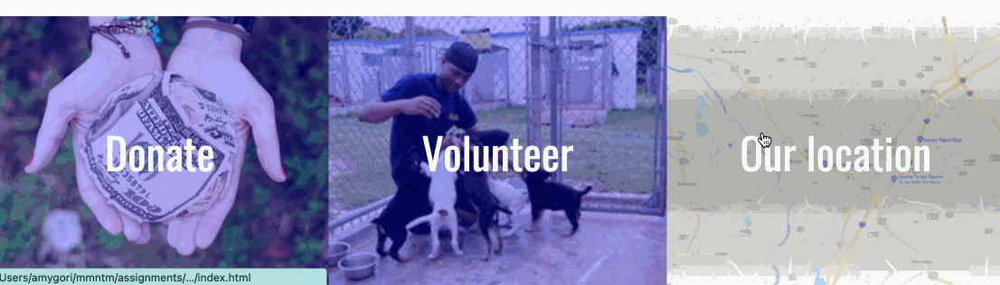

# Build a Small Non-Profit Website -- CSS Edition

## Requirements

Your task is to add styling to your dog adoption HTML site. You can use the HTML you have already written, although keep in mind that you will likely need to make some changes in order to style the page the way you need to.

To submit this project, you must push your code to GitHub.

The pages should look like the following:

### Home


### Adopt


### Contact


The fonts used are Open Sans and Oswald, and can be included by adding the following line to your stylesheet:

```html
@import url('https://fonts.googleapis.com/css2?family=Open+Sans&family=Oswald:wght@400;600&display=swap');
```

The link to the adoption application form can go to `#`, which is a way to link to the same page as you are currently on.

## Hints for the Page Sections

Each page can be broken into three major sections: the header, the main part, and the footer. As with all projects, the goal is learning, not perfect completion, but you should aim to reproduce the images you see for each page with a reasonable level of similarity -- we are not looking for pixel perfection.

### The header

This section has a background color, some padding, and a border on the bottom. Start by getting the text to show, then change the background and text colors. After that, you can add the padding and bottom border.

The hex value for the background color is `#004175`.

The hex value for the border color is `#89DEEF`.

### The dogs

The first thing you want to do is to get the dogs' names, images, and traits to show. Think about what HTML elements make the most sense here. Don't let the default styling overly influence your decision. For example, the traits are a list of items -- what HTML element represents a list of items?

Once you have these showing, work on the fonts and colors. The color behind each trait is #89DEEF.

Get the traits to show up next to each other. They still need some padding and margin. There are two good ways to get them to look like they should: [flexbox](https://www.freecodecamp.org/news/an-animated-guide-to-flexbox-d280cf6afc35/) and [`display: inline-block`](https://medium.com/better-programming/understanding-css-display-none-block-inline-and-inline-block-63f6510df93). If you use Flexbox, you'll need to [know how to wrap the elements](https://developer.mozilla.org/en-US/docs/Web/CSS/CSS_Flexible_Box_Layout/Basic_Concepts_of_Flexbox#Multi-line_flex_containers_with_flex-wrap)

Finally, once you have each dog showing up with its image and traits, but each one on top of the next, use flexbox or inline-block to lay them out on the page next to each other. **Important**: they don't have to be three-in-a-row. They could be 1, 2, 3, 4, or more depending on the size of the browser. The web is made for fluid documents.

### The footer

This is the most difficult section. Once you have the three words on the page, try laying them out in three blocks next to each other. (These should always be in three blocks.) Flexbox may be your friend here. If you are using flexbox, the property `flex: 1 1 auto` should be applied to each block to get them to grow to fill the page.

Once they are next to each other, give them some height and center the text horizontally in them. This should be fairly straightforward.

You will also need to center them vertically. Centering things both horizontally and vertically used to be super challenging in CSS, but modern CSS makes this relatively simple. Still, there are multiple ways you can do this. [This guide to centering in CSS will be helpful](https://moderncss.dev/complete-guide-to-centering-in-css/).

Next, add a background color (`#A6A9F0`). If you can do this, you're almost done!

The last and hardest challenge is getting the images to appear with the bluish filter on them. The `background` property will make this work, and you [can read how to add a color overly to an image at CSS-Tricks](https://css-tricks.com/tinted-images-multiple-backgrounds/).

## 🌶️ Extra Spicy Option

The CSS challenges in this project are pretty spicy as is, but if you are up for one more challenge...

Can you add a hover effect to the footer, so that if you hover over an image, the blue overlay disappears?


